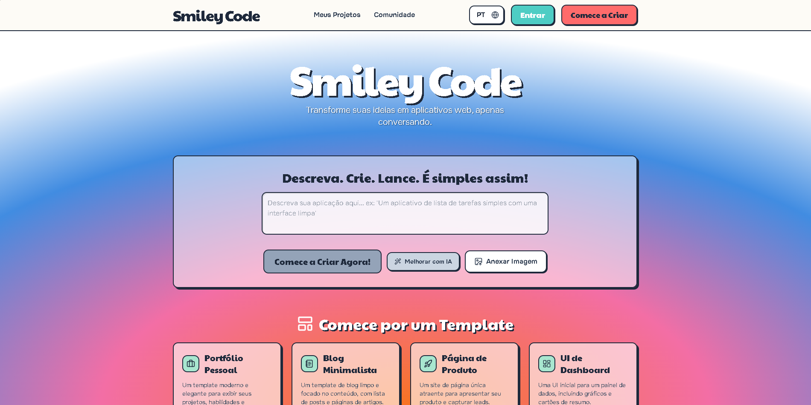

# Smiley Code - Construtor de Aplicações Web com IA

Smiley Code é uma plataforma revolucionária onde você constrói aplicações web completas conversando com um assistente de IA avançado. Simplesmente descreva sua visão e veja ela ganhar vida em tempo real.

## Características

- **Desenvolvimento Conversacional**: Construa aplicações descrevendo o que você quer
- **Visualização ao Vivo**: Veja sua aplicação atualizar em tempo real
- **Editor de Código**: Editor completo com destaque de sintaxe
- **Controle de Versão**: Sistema de versionamento integrado
- **Deploy com Um Clique**: Faça deploy para Vercel com um único clique
- **Biblioteca de Templates**: Comece com templates pré-construídos
- **Suporte Multi-idioma**: Português, Inglês e Espanhol

## Como Começar

**Pré-requisitos:** Node.js

1. Instale as dependências:
   `npm install`
2. Configure a `GEMINI_API_KEY` no arquivo [.env.local](.env.local) com sua chave da API Gemini
3. Execute a aplicação:
   `npm run dev`

## Stack Tecnológica

- React + TypeScript
- Vite
- Tailwind CSS
- Google Gemini AI
- Framer Motion
- Supabase

## Autor

**Luiz Antônio De Lima Mendonça**
- Localização: Resende, Rio de Janeiro, Brasil
- GitHub: [@invictsquad](https://github.com/invictsquad)

## Licença

Este projeto é de código aberto sob a Licença MIT. Veja o arquivo LICENSE para detalhes.

### Direitos Autorais

Se você usar este código ou criar um fork, por favor:
- Mantenha os créditos ao autor original
- Inclua um link para o repositório oficial: https://github.com/invictsquad/Smiley-Code
- Respeite os termos da licença MIT

## Repositório Oficial

🔗 **Link oficial**: https://github.com/invictsquad/Smiley-Code

---

Feito com ❤️ por Luiz Antônio De Lima Mendonça em Resende, RJ - Brasil
